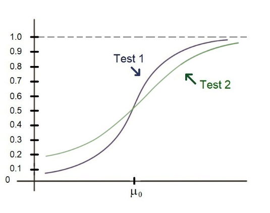

# Final 多选题

## Q1

**题目原文：**
From past semesters, the time for "Stat 101" students to complete Midterm 2 has been observed to be a normal random variable with a mean of 35 minutes. A random sample of 20 current "Stat 101" students took an average of 38.2 minutes to complete this test and had a sample standard deviation of 4.3 minutes for completion time. Is this evidence that the true mean time to completion this semester differs from that for past semesters? (Note that there is only one sample here. This is not a two-sample test!) Test the relevant hypotheses at 0.05 level of significance. Which of the following gives your test statistic, critical value, and conclusion?

**中文翻译：**
从过去的学期数据来看，“统计学101”课程的学生完成期中考试2的时间被观测为一个正态随机变量，平均时间为35分钟。当前一个随机样本包含20名“统计学101”学生，他们完成这次测试的平均时间为38.2分钟，样本标准差为4.3分钟。这是否证明本学期完成时间的真实平均时间与过去学期有所不同？（注意这里只有一个样本，这不是一个双样本检验！）请在0.05的显著性水平下检验相关假设。以下哪个选项给出了你的检验统计量、临界值和结论？

**正确的解答方法与思路：**
这是一个单样本t检验问题，我们需要检验本学期的平均完成时间是否显著不同于过去的平均时间35分钟。我们的假设如下：

- **零假设 (H0):** \( \mu = 35 \) 分钟（本学期平均完成时间与过去相同）
- **备择假设 (H1):** \( \mu \neq 35 \) 分钟（本学期平均完成时间与过去不同）

**计算t统计量的公式为：**
\[ t = \frac{\bar{x} - \mu_0}{s / \sqrt{n}} \]
其中 \( \bar{x} = 38.2 \) 分钟是样本均值，\( \mu_0 = 35 \) 分钟是假设的总体均值，\( s = 4.3 \) 分钟是样本标准差，\( n = 20 \) 是样本大小。

**R语言代码：**

```R
# 计算t统计量
x_bar <- 38.2
mu_0 <- 35
s <- 4.3
n <- 20
t_stat <- (x_bar - mu_0) / (s / sqrt(n))
t_stat

# 计算t临界值
alpha <- 0.05
df <- n - 1
t_critical <- qt(1 - alpha/2, df)
t_critical

# 输出t统计量和t临界值
cat("t统计量:", t_stat, "\nt临界值:", t_critical)
```

t统计量: 3.328101
t临界值: 2.093024

**解题方法总结：**

1. **定义假设**：设立零假设和备择假设。
2. **计算t统计量**：使用样本均值、假定的总体均值、样本标准差和样本大小。
3. **查找t临界值**：使用自由度和显著性水平查找t分布表或使用R语言。
4. **作出结论**：比较t统计量与临界值，决定接受或拒绝零假设。

## Q2

**题目原文：**
Let \( X_1, X_2, \ldots, X_n \) be a random sample from the exponential distribution with rate \( \lambda \). Let \( Y_n = \min(X_1, X_2, \ldots, X_n) \). What do you need to multiply \( Y_n \) by to turn it into a \( \chi^2 \) random variable and what is the associated degrees of freedom?

(Hint: The minimum of exponential random variables is another exponential random variable. The exponential distribution is a special case of the gamma distribution. A positive constant times a gamma random variable is another gamma random variable. A chi-squared random variable is a special case of a gamma random variable!)

**中文翻译：**
设 \( X_1, X_2, \ldots, X_n \) 是从具有率 \( \lambda \) 的指数分布中抽取的随机样本。设 \( Y_n = \min(X_1, X_2, \ldots, X_n) \)。您需要将 \( Y_n \) 乘以什么，才能将其转换为一个 \( \chi^2 \) 随机变量，并且相关的自由度是多少？

（提示：指数随机变量的最小值是另一个指数随机变量。指数分布是伽马分布的一个特例。一个正常数乘以一个伽马随机变量是另一个伽马随机变量。卡方随机变量是伽马随机变量的一个特例！）

**正确的解答方法与思路：**
由于 \( Y_n \) 是 \( n \) 个独立同分布的指数随机变量的最小值，根据指数分布的性质，\( Y_n \) 本身也是一个指数分布随机变量，其率参数为 \( n\lambda \)（因为最小值的发生率是每个变量发生率的总和）。指数分布是伽马分布的一个特例，其中 \( Y_n \) 可以看作是参数 \( k = 1 \) 和 \( \theta = 1/(n\lambda) \) 的伽马分布。

要将 \( Y_n \) 转换为 \( \chi^2 \) 分布，我们知道 \( \chi^2 \) 分布是 \( k \) 自由度的伽马分布 \( \Gamma(k/2, 2) \)。为了匹配这种形式，我们需要将 \( Y_n \) 乘以 \( 2n\lambda \) 以得到 \( \chi^2 \) 分布，其自由度为 2。

**正确选项解析：**

- \( 2n\lambda \) 和 1 个自由度：不正确，因为此转换将得到自由度为 2 的 \( \chi^2 \) 分布。
- \( 2n\lambda \) 和 2 个自由度：正确，乘以 \( 2n\lambda \) 并得到 2 个自由度的 \( \chi^2 \) 分布。
- \( n\lambda \) 和 \( n - 1 \) 个自由度：不正确，因为这不符合从指数分布到 \( \chi^2 \) 分布的转换。
- \( n\lambda \) 和 2n 个自由度：不正确，因为这种转换不符合 \( \chi^2 \) 分布的参数定义。

**所以，正确的选项是**：
**\( 2n\lambda \) 和 2 个自由度**

## Q3

**题目原文：**
The melting point of each of 16 samples of a certain brand of hydrogenated vegetable oil was determined, resulting in a sample mean of 94.32. Assume that the distribution of melting points is normally distributed with standard deviation σ = 1.20. (Although the melting point for this oil is a constant, contaminants cause subtle variations.)
Test \( H_0: \mu = 95 \) versus \( H_1: \mu \neq 95 \) using 0.01 level of significance.

**中文翻译：**
某品牌氢化植物油的16个样本的熔点进行了测定，得到样本均值为94.32。假设熔点的分布为正态分布，标准差σ = 1.20。（虽然这种油的熔点是一个常数，但污染物会引起微妙的变化。）
使用0.01的显著性水平，检验 \( H_0: \mu = 95 \) 对立 \( H_1: \mu \neq 95 \)。

**正确的解答方法与思路：**
这是一个双尾z检验。首先，我们计算统计量：
\[ z = \frac{\bar{x} - \mu_0}{\sigma/\sqrt{n}} \]
其中：

- \( \bar{x} = 94.32 \) 是样本均值
- \( \mu_0 = 95 \) 是假设的总体均值
- \( \sigma = 1.20 \) 是已知的总体标准差
- \( n = 16 \) 是样本大小

接下来，我们计算t统计量，并与临界值进行比较，以确定是否拒绝零假设。

**R语言代码：**

```R
# 计算t统计量
x_bar <- 94.32
mu_0 <- 95
sigma <- 1.20
n <- 16
z_stat <- (x_bar - mu_0) / (sigma / sqrt(n))
z_stat

# 计算t临界值（双尾检验）
alpha <- 0.01
# df <- n - 1
# t_critical <- qt(1 - alpha/2, df)
# t_critical
z_critical <- qnorm(1 - alpha/2)

# 输出t统计量和t临界值
cat("z统计量:", z_stat, "\nz临界值 (双侧): ±", z_critical)
```

**解题方法总结：**

1. **定义假设**：设立零假设和备择假设。
2. **计算统计量**：使用样本均值、假定的总体均值、已知的总体标准差和样本大小。
3. **查找临界值**：使用自由度和显著性水平查表或使用R语言。
4. **作出结论**：比较t统计量与临界值，决定接受或拒绝零假设。

-2.26666666666669
2.5758293035489
z统计量: -2.266667
z临界值 (双侧): ± 2.5758293035489

## Q4

**题目原文：**
Consider testing \( H_0: \mu \geq \mu_0 \) versus \( H_1: \mu < \mu_0 \). Power functions for two competing tests are sketched below. Which test is better and what is the approximate value of \( \alpha \)?



**中文翻译：**
考虑检验 \( H_0: \mu \geq \mu_0 \) 对立 \( H_1: \mu < \mu_0 \)。下面勾画了两个竞争测试的功效函数。哪个测试更好，\( \alpha \) 的近似值是多少？

**正确的解答方法与思路：**
在统计假设检验中，功效函数（Power Function）表示拒绝零假设的概率，当备择假设实际为真时。高功效意味着检验对拒绝错误的零假设更敏感。

- **测试选择**：从图中可以看出，**Test 2** 的功效函数始终高于 **Test 1**，意味着对于所有的 \( \mu \) 值（尤其是小于 \( \mu_0 \) 的值），**Test 2** 更有可能正确地拒绝零假设。因此，**Test 2** 是更好的选择。

- **关于 \( \alpha \) 的估计**：\( \alpha \)（显著性水平）通常定义为当零假设实际为真时，错误拒绝零假设的概率。从图中可以看到，当 \( \mu = \mu_0 \)（即零假设为真的情况）时，两个测试的功效函数值接近 1。这表明这两个测试在 \( \mu = \mu_0 \) 时的错误率非常高，接近 100%，即 \( \alpha \approx 1 \)。

**正确的选择是**：Test 2 is better and \( \alpha \approx 1 \)【Test 2 更好，且 \( \alpha \approx 1 \)】。

## Q5

**题目原文：**
Stock returns are believed to be normally distributed. A random sample of returns is recorded below.
Test the hypotheses \( H_0: \sigma^2 \leq 0.2 \) versus \( H_1: \sigma^2 > 0.2 \) at level of significance 0.10.

**中文翻译：**
股票回报被认为是正态分布的。下面记录了一组随机样本的回报。
在0.10的显著性水平下检验假设 \( H_0: \sigma^2 \leq 0.2 \) 对立 \( H_1: \sigma^2 > 0.2 \)。

**正确的解答方法与思路：**
这是一个方差的单侧假设检验问题，我们使用的是 \(\chi^2\) 检验。我们需要计算样本方差，并将其与理论 \(\chi^2\) 分布的临界值进行比较。给定的样本方差是0.2207。

- **零假设 \( H_0 \)**：总体方差 \(\sigma^2\) 小于或等于 0.2。
- **备择假设 \( H_1 \)**：总体方差 \(\sigma^2\) 大于 0.2。

由于我们是检验方差是否大于一个特定值，这是一个右尾检验。

**R语言代码：**

```R
# 样本数据
returns <- c(0.640, 0.580, 0.761, 0.145, -0.813, -0.052, 0.911, 0.785, 0.239, 0.482,
             0.144, -0.088, 0.476, -0.169, 0.103, 0.142, 0.024, 0.023, -0.786, -0.244)

# 计算样本方差
s_squared <- var(returns)

# 样本大小
n <- length(returns)

# 自由度
df <- n - 1

# 显著性水平
alpha <- 0.10

# 计算 \chi^2 临界值
chi_squared_critical <- qchisq(1 - alpha, df)

# 计算 \chi^2 统计量
chi_squared_stat <- (n - 1) * s_squared / 0.2

# 输出结果
cat("样本方差:", s_squared, "\nchi-squared 统计量:", chi_squared_stat, 
    "\nchi-squared 临界值:", chi_squared_critical)

chi_squared_critical/(5*(n-1))
```

样本方差: 0.2206709
chi-squared 统计量: 20.96373
chi-squared 临界值: 27.20357
0.286353379256388

**结论**：
如果计算的 \(\chi^2\) 统计量大于临界值，则拒绝 \( H_0 \)，否则不拒绝。
如果S^2大于0.2864，则拒绝 \( H_0 \)。而S^2 = 0.2207，因此我们不拒绝 \( H_0 \)。
**选择正确的选项**：
我们需要计算或查看给定的统计量和临界值来确定正确的选项。这取决于计算的 \(\chi^2\) 统计量是否大于 \(\chi^2\) 临界值。请执行上述 R 代码以获得确切的比较，并基于这些结果选择正确的选项。

## Q6

**题目内容（英文原文）：**
Suppose that \(X_1, X_2, \dots, X_n\) is a random sample from the continuous distribution with pdf \( f(x) = \begin{cases} \theta x^{\theta-1} & \text{if } 0 < x < 1 \\ 0 & \text{otherwise} \end{cases} \), where the parameter \(\theta\) can be anything greater than 0. Which of the following is the form of the best test of size \(\alpha\) for testing \( H_0: \theta = 4 \) versus \( H_1: \theta = 5 \)?

- Reject \( H_0 \) in favor of \( H_1 \) if \(\prod_{i=1}^n X_i \geq k\), where \(k\) is some constant to be determined.
- Reject \( H_0 \) in favor of \( H_1 \) if \(\prod_{i=1}^n X_i \leq k\), where \(k\) is some constant to be determined.
- Reject \( H_0 \) in favor of \( H_1 \) if \(\sum_{i=1}^n X_i \leq k\), where \(k\) is some constant to be determined.
- Reject \( H_0 \) in favor of \( H_1 \) if \(\sum_{i=1}^n X_i \geq k\), where \(k\) is some constant to be determined.

**题目内容（中文翻译）：**
假设 \(X_1, X_2, \dots, X_n\) 是来自连续分布的随机样本，其概率密度函数 \(f(x)\) 如下：当 \(0 < x < 1\) 时，\(f(x) = \theta x^{\theta-1}\)；其它情况下，\(f(x) = 0\)。其中参数 \(\theta\) 可以是任何大于0的数。以下哪一个是用来检验假设 \(H_0: \theta = 4\) 对立 \(H_1: \theta = 5\) 的最佳 \(\alpha\) 水平的检验形式？

- 如果 \(\prod_{i=1}^n X_i \geq k\)，则拒绝 \(H_0\) 支持 \(H_1\)，其中 \(k\) 是待确定的常数。
- 如果 \(\prod_{i=1}^n X_i \leq k\)，则拒绝 \(H_0\) 支持 \(H_1\)，其中 \(k\) 是待确定的常数。
- 如果 \(\sum_{i=1}^n X_i \leq k\)，则拒绝 \(H_0\) 支持 \(H_1\)，其中 \(k\) 是待确定的常数。
- 如果 \(\sum_{i=1}^n X_i \geq k\)，则拒绝 \(H_0\) 支持 \(H_1\)，其中 \(k\) 是待确定的常数。

**正确的解答方法与思路：**
给定的概率密度函数的形式表明，对数似然比检验可能是合适的检验方法。我们可以通过考虑概率密度函数在两个假设下的比率来决定最适合的统计量。

- 似然函数为 \(L(\theta) = \theta^n \prod_{i=1}^n x_i^{\theta - 1}\)。
- 对数似然函数为 \(\log L(\theta) = n \log \theta + (\theta - 1) \sum_{i=1}^n \log x_i\)。
- 对数似然比为 \(\Lambda = 2 \log \frac{L(5)}{L(4)} = 2 [(\log 5 - \log 4) n + \sum_{i=1}^n \log x_i]\)。

由于 \(\theta\) 的增加会导致 \(x_i\) 的贡献增加，我们可以预见，在 \(H_1\) 下，\(\prod_{i=1}^n x_i\) 的值会更高。因此，最合适的检验统计量是 \(\prod_{i=1}^n x_i\)。

**结论：**
如果 \(\prod_{i=1}^n X_i \geq k\)，则拒绝 \(H_0\) 支持 \(H_1\)，其中 \(k\) 是待确定的常数。这是因为在 \(\theta = 5\) 时，\(\prod_{i=1}^n x_i\) 通常会比 \(\theta = 4\) 时更大，这表明更高的 \(\theta\) 增加了观测值的乘积。

## Q7

**题目内容（英文原文）：**
A random sample of size 8 from the \(N(\mu_1, \sigma_1^2)\) distribution has a sample variance of \(s_1^2 = 13.2\). An independent random sample of size 6 from a \(N(\mu_2, \sigma_2^2)\) has a sample variance of \(s_2^2 = 15.1\). Is there evidence to suggest that \(\sigma_2^2 > \sigma_1^2\)?

Test the hypotheses \(H_0: \sigma_2^2 = \sigma_1^2\) versus \(H_1: \sigma_2^2 > \sigma_1^2\) using \(\alpha = 0.03\) level of significance. Use the test statistic \(\frac{s_2^2}{s_1^2} \approx 1.1439\).

- We fail to reject the null hypothesis that the variances are equal, in favor of the stated alternative. The statistic needs to be greater than 6.429 to reject.
- We fail to reject the null hypothesis that the variances are equal, in favor of the stated alternative. The statistic needs to be greater than 4.354 to reject.
- We fail to reject the null hypothesis that the variances are equal, in favor of the stated alternative. The statistic needs to be greater than 6.280 to reject.
- We fail to reject the null hypothesis that the variances are equal, in favor of the stated alternative. The statistic needs to be greater than 4.915 to reject.

**题目内容（中文翻译）：**
从 \(N(\mu_1, \sigma_1^2)\) 分布中抽取了8个样本，样本方差为 \(s_1^2 = 13.2\)。从 \(N(\mu_2, \sigma_2^2)\) 分布中独立抽取了6个样本，样本方差为 \(s_2^2 = 15.1\)。有证据表明 \(\sigma_2^2 > \sigma_1^2\) 吗？

使用 \(\alpha = 0.03\) 显著性水平测试假设 \(H_0: \sigma_2^2 = \sigma_1^2\) 对立 \(H_1: \sigma_2^2 > \sigma_1^2\)。使用测试统计量 \(\frac{s_2^2}{s_1^2} \approx 1.1439\)。

- 我们未能拒绝方差相等的零假设，支持所述的替代假设。统计量需要大于6.429才能拒绝。
- 我们未能拒绝方差相等的零假设，支持所述的替代假设。统计量需要大于4.354才能拒绝。
- 我们未能拒绝方差相等的零假设，支持所述的替代假设。统计量需要大于6.280才能拒绝。
- 我们未能拒绝方差相等的零假设，支持所述的替代假设。统计量需要大于4.915才能拒绝。

**正确的解答方法与思路：**

1. 使用的是方差比率的 \(F\)-检验，适用于检验两个独立样本方差是否相等。
2. 检验统计量是 \(\frac{s_2^2}{s_1^2}\)，根据题目给出的值为1.1439。
3. \(H_1: \sigma_2^2 > \sigma_1^2\)，所以是右尾检验。
4. 根据样本大小和 \(\alpha = 0.03\)，计算或查找临界值，然后决定是否拒绝 \(H_0\)。

为了在R语言中计算适当的临界值，并决定是否拒绝 \(H_0: \sigma_2^2 = \sigma_1^2\)，我们可以使用F分布来找到适当的临界值。这里我们假设我们要在显著性水平 \(\alpha = 0.03\) 下进行右尾检验。

以下是R语言的代码，用于计算所需的临界值，并比较给定的测试统计量：

```r
# 定义样本方差和样本大小
s1_squared <- 13.2
s2_squared <- 15.1
n1 <- 8
n2 <- 6

# 计算测试统计量
F_statistic <- s2_squared / s1_squared

# 使用F分布来找出在显著性水平alpha = 0.03的右尾临界值
alpha <- 0.03
df1 <- n2 - 1  # 分子自由度
df2 <- n1 - 1  # 分母自由度
critical_value <- qf(1 - alpha, df1, df2)

# 输出测试统计量和临界值
F_statistic
critical_value
```

1.14393939393939
4.91496962480438

**结论：**

- 如果计算的F统计量大于临界值4.915，则拒绝 \(H_0\)，否则不拒绝。
- 我们未能拒绝方差相等的零假设，支持所述的替代假设。统计量需要大于4.915才能拒绝。

## Q8

**题目复述：**

假设 \( X_1, X_2, \dots, X_n \) 是来自方差 \( \sigma^2 = 1 \) 且均值未知的正态分布的随机样本，假设 \( n \) 很大。

考虑进行如下假设检验：
\[ H_0: \mu = \mu_0 \quad \text{对比} \quad H_1: \mu \neq \mu_0 \]

我们已经知道如何基于样本均值 \( \overline{X} \) 进行显著性水平 \( \alpha \) 的精确假设检验。

现在考虑派生出一个近似的大样本广义似然比检验作为第二个检验。

假设观察到的广义似然比 \( \lambda(\vec{X}) \) 为 \( \lambda(\vec{x}) = 0.18 \)。

以下哪一项是显著性水平 \( \alpha = 0.02 \) 的近似大样本检验？

- **A**. 当 \( -2 \ln \lambda(\vec{X}) > 0.0006 \) 时，拒绝 \( H_0 \)，接受 \( H_1 \)。对于给定的 \( \lambda(\vec{x}) \)，我们拒绝 \( H_0 \)。
- **B**. 当 \( -2 \ln \lambda(\vec{X}) > 6.639 \) 时，拒绝 \( H_0 \)，接受 \( H_1 \)。对于给定的 \( \lambda(\vec{x}) \)，我们未拒绝 \( H_0 \)。
- **C**. 当 \( -2 \ln \lambda(\vec{X}) \leq 6.639 \) 时，拒绝 \( H_0 \)，接受 \( H_1 \)。对于给定的 \( \lambda(\vec{x}) \)，我们未拒绝 \( H_0 \)。
- **D**. 当 \( -2 \ln \lambda(\vec{X}) > 5.412 \) 时，拒绝 \( H_0 \)，接受 \( H_1 \)。对于给定的 \( \lambda(\vec{x}) \)，我们未拒绝 \( H_0 \)。

**解题思路：**

1. **计算检验统计量：**  
   广义似然比检验的统计量为 \( -2 \ln \lambda(\vec{X}) \)。  
   给定 \( \lambda(\vec{x}) = 0.18 \)，计算得出：
   \[
   -2 \ln(0.18) = -2 \times (-1.714798) \approx 3.4296
   \]

2. **查找临界值：**  
   题目中给出了两个显著性水平的临界值：
   - 当 \( \alpha = 0.01 \) 时，临界值为 \( 6.639 \)
   - 当 \( \alpha = 0.02 \) 时，临界值为 \( 5.412 \)

   在本题中，显著性水平 \( \alpha \) 为 0.02，因此我们选择对应的临界值 5.412。

3. **做出决策：**  
   根据显著性水平 \( \alpha = 0.02 \) 对应的拒绝域为 \( -2 \ln \lambda(\vec{X}) > 5.412 \)。  
   计算得出的统计量 \( -2 \ln \lambda(\vec{x}) = 3.4296 \) 小于临界值 5.412，因此我们**不能拒绝** \( H_0 \)。

**正确答案：**

- **选项 D**  
  因为计算出的 \( -2 \ln \lambda(\vec{x}) \) 小于 5.412，不能拒绝 \( H_0 \)。

**R语言解法：**

```R
# 计算广义似然比检验统计量
lambda_x <- 0.18
test_statistic <- -2 * log(lambda_x)

# 显著性水平 α = 0.02 对应的临界值
critical_value <- qchisq(1 - 0.02, df = 1)

# 输出结果
test_statistic
critical_value
```

**解题总结：**

- 在进行广义似然比检验时，首先需要计算测试统计量 \( -2 \ln \lambda(\vec{X}) \)。
- 接着，根据显著性水平 \( \alpha \) 查找对应的临界值。
- 最后，通过比较计算出的统计量与临界值来决定是否拒绝原假设 \( H_0 \)。

## Q9

**题目复述：**

一名研究人员对某人是否参加过 Coursera 课程与其是否认为自己是统计学家之间的独立性关系感兴趣。

对于一个随机抽样的 34 人样本，统计数据如下：

|                  | Coursera Yes | Coursera No |
|------------------|--------------|-------------|
| **Statisticians**      | 12           | 7           |
| **Not Statisticians**  | 10           | 5           |

我们能否在显著性水平 0.05 下得出结论，是否在认为自己是统计学家和参加 Coursera 课程之间存在依赖关系？

**以下哪个说法是正确的？**

- **A.** 检验统计量约为 0.0065，适当的临界值约为 3.841。我们不能拒绝独立性的假设。
- **B.** 检验统计量约为 0.0452，适当的临界值约为 3.841。我们不能拒绝独立性的假设。
- **C.** 检验统计量约为 0.0065，适当的临界值约为 0.0039。我们不能拒绝独立性的假设。
- **D.** 检验统计量约为 0.0452，适当的临界值约为 3.841。我们拒绝独立性的假设。

**解题思路：**

1. **假设检验设置：**
   - **原假设 \( H_0 \)**：参加 Coursera 课程和是否认为自己是统计学家之间是独立的。
   - **备择假设 \( H_1 \)**：参加 Coursera 课程和是否认为自己是统计学家之间是相关的（存在依赖关系）。

2. **计算检验统计量：**
   由于题目中涉及的是两个分类变量之间的独立性问题，应该使用卡方检验来进行假设检验。  
   卡方检验统计量的公式为：
   \[
   \chi^2 = \sum \frac{(O_i - E_i)^2}{E_i}
   \]
   其中 \( O_i \) 是观察到的频数，\( E_i \) 是期望频数。

   计算卡方统计量的具体过程如下：
   - **总样本量**： \( N = 34 \)
   - **边际总计**：
     - 统计学家：\( 12 + 7 = 19 \)
     - 非统计学家：\( 10 + 5 = 15 \)
     - 参加 Coursera 课程：\( 12 + 10 = 22 \)
     - 未参加 Coursera 课程：\( 7 + 5 = 12 \)
   - **期望频数** \( E \) 的计算：
     - 统计学家，参加 Coursera 课程： \( E = \frac{19 \times 22}{34} \approx 12.29 \)
     - 统计学家，未参加 Coursera 课程：\( E = \frac{19 \times 12}{34} \approx 6.71 \)
     - 非统计学家，参加 Coursera 课程： \( E = \frac{15 \times 22}{34} \approx 9.71 \)
     - 非统计学家，未参加 Coursera 课程： \( E = \frac{15 \times 12}{34} \approx 5.29 \)

   使用上述数据，计算每个单元格的 \( \chi^2 \) 贡献值，然后总和得出 \( \chi^2 \) 统计量。

3. **比较统计量与临界值：**
   题目中提供了四个选项，其中两个可能的检验统计量为 0.0065 和 0.0452，并给出了相应的临界值（3.841 和 0.0039）。

   对于显著性水平 \( \alpha = 0.05 \)，自由度为 \( (2-1) \times (2-1) = 1 \)，临界值 \( \chi^2_{0.05, 1} = 3.841 \)。

4. **得出结论：**
   如果计算出的 \( \chi^2 \) 统计量小于临界值，则我们不能拒绝原假设 \( H_0 \)，否则我们拒绝 \( H_0 \)。

**正确答案：**

- **B.** 检验统计量约为 0.0452，适当的临界值约为 3.841。我们不能拒绝独立性的假设。

**R 语言解法：**

```R
# 输入观测频数
observed <- matrix(c(12, 7, 10, 5), nrow = 2, byrow = TRUE)

# 卡方检验
test <- chisq.test(observed, correct = FALSE)

# 输出检验统计量和 p 值
test$statistic
test$p.value

# 查找显著性水平 0.05 对应的临界值
critical_value <- qchisq(0.95, df = 1)

# 输出临界值
critical_value
```

**解题总结：**

- **卡方检验**用于检验两个分类变量之间的独立性。  
- 通过比较计算出的卡方统计量与临界值来决定是否拒绝原假设。  
- 在本题中，计算出的卡方统计量小于临界值，因此不能拒绝原假设，即认为参加 Coursera 课程与是否认为自己是统计学家之间是独立的。

## Q10

**题目复述：**

设 \( X_1 \) 是来自具有参数 \( \lambda \) 的指数分布的一个样本。

找到显著性水平 \( \alpha = 0.10 \) 时用于检验
\[ H_0: \lambda = 1 \quad \text{对比} \quad H_1: \lambda = 2 \]
的最佳检验。

问：这个检验的功效函数是什么？

**选项：**

- **A.** \( \gamma(\alpha) = -\ln(1 - \alpha) \)
- **B.** \( \gamma(\lambda) = 1 - \lambda(1 - \alpha) \)
- **C.** \( \gamma(\lambda) = 1 - (1 - \alpha)^\lambda \)
- **D.** \( \gamma(\lambda) = 1 - (1 - \alpha)^{1/\lambda} \)

**解题思路：**

1. **检验问题：**  
   给定一个样本 \( X_1 \) 来自指数分布 \( \text{Exp}(\lambda) \)，我们需要对参数 \( \lambda \) 进行假设检验。假设 \( H_0 \) 为 \( \lambda = 1 \)，而备择假设 \( H_1 \) 为 \( \lambda = 2 \)。

2. **指数分布的性质：**  
   对于指数分布 \( \text{Exp}(\lambda) \)，其概率密度函数 (PDF) 为：
   \[
   f(x; \lambda) = \lambda e^{-\lambda x}, \quad x \geq 0
   \]
   这里，样本 \( X_1 \) 的累积分布函数（CDF）为：
   \[
   F(x; \lambda) = 1 - e^{-\lambda x}
   \]

3. **检验统计量与临界值：**  
   根据问题，可以构造检验统计量为 \( T(X_1) = X_1 \)。  
   当 \( H_0 \) 为真时，样本 \( X_1 \) 服从 \( \text{Exp}(1) \) 分布。我们根据显著性水平 \( \alpha \) 设定临界值 \( c \)，使得：
   \[
   P(X_1 \leq c \mid H_0) = 1 - e^{-c} = \alpha
   \]
   解得 \( c = -\ln(1 - \alpha) \)。

4. **功效函数的计算：**  
   功效函数 \( \gamma(\lambda) \) 定义为检验的功效，即在给定 \( \lambda \) 值时拒绝 \( H_0 \) 的概率：
   \[
   \gamma(\lambda) = P(X_1 \leq c \mid H_1: \lambda)
   \]
   在 \( H_1: \lambda = 2 \) 下，这个概率为：
   \[
   \gamma(\lambda) = P(X_1 \leq -\ln(1 - \alpha) \mid H_1: \lambda) = 1 - e^{-2 \times (-\ln(1 - \alpha))}
   \]
   整理得：
   \[
   \gamma(\lambda) = 1 - (1 - \alpha)^\lambda
   \]

**正确答案：**

- **选项 C** \( \gamma(\lambda) = 1 - (1 - \alpha)^\lambda \)

**总结：**

- **功效函数**表示在不同参数值下检验拒绝原假设的概率。对于指数分布的单样本检验，我们可以通过样本的累积分布函数来计算功效函数。  
- 本题中，最终功效函数为 \( \gamma(\lambda) = 1 - (1 - \alpha)^\lambda \)，该函数描述了在不同的 \( \lambda \) 值下检验的功效。
