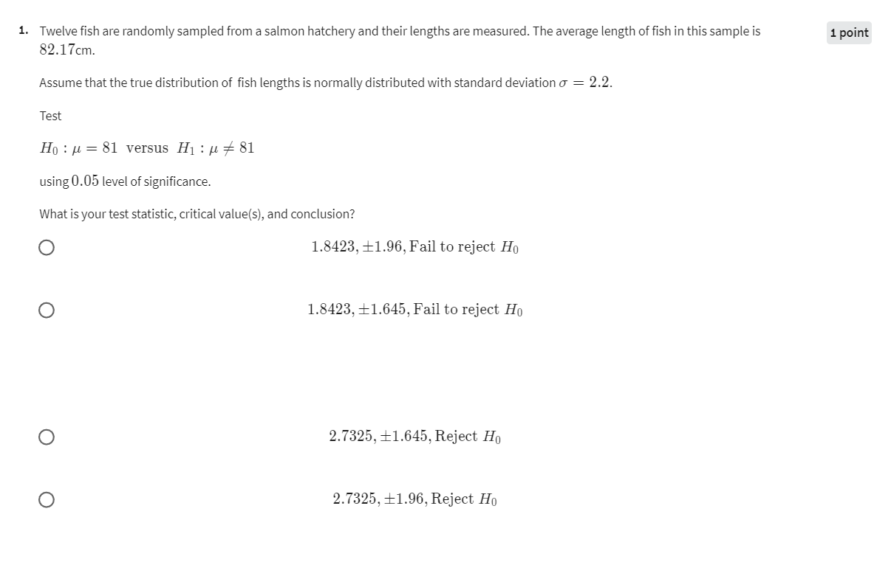
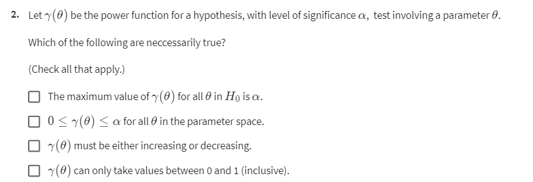
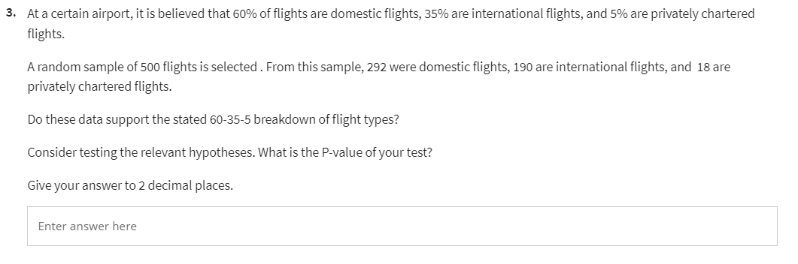
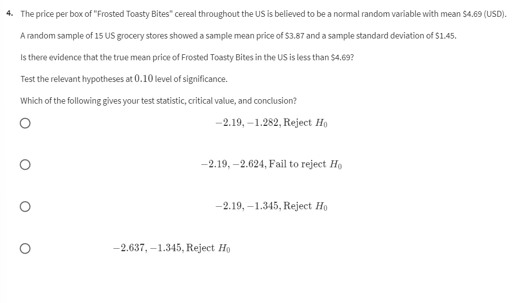
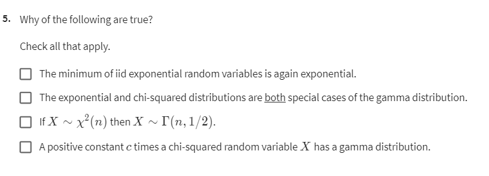
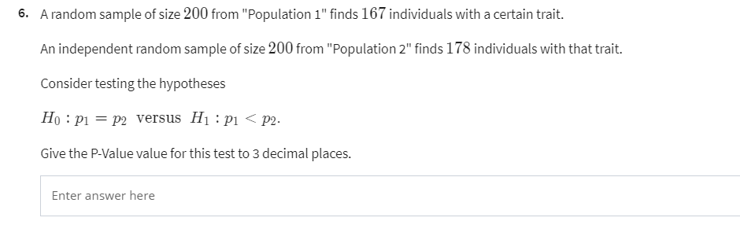
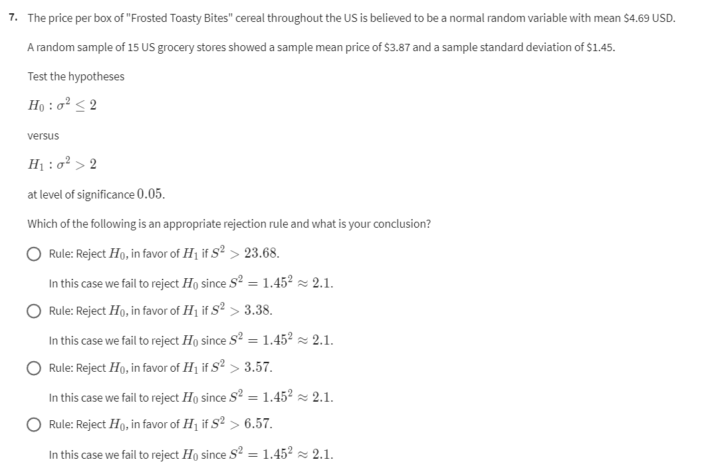
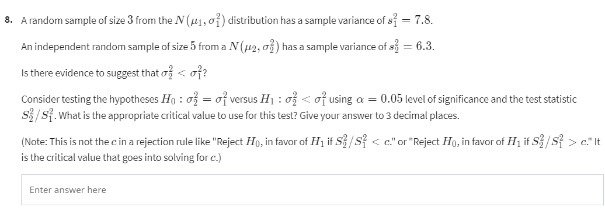
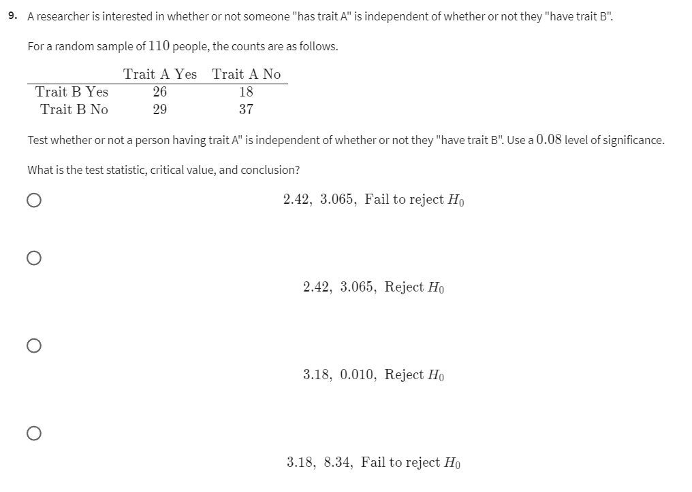

# Preparations for the final exam

Table of Contents

## Q1



Twelve fish are randomly sampled from a salmon hatchery, and their lengths are measured. The average length of fish in this sample is 82.17 cm. Assume that the true distribution of fish lengths is normally distributed with a standard deviation of σ = 2.2 cm.

You are required to test the hypothesis \(H_0: \mu = 81\) versus \(H_1: \mu \neq 81\) using a 0.05 level of significance.

You need to find the test statistic, critical value(s), and conclusion. The options are:

1. \(1.8423\), \(±1.96\), Fail to reject \(H_0\)
2. \(1.8423\), \(±1.645\), Fail to reject \(H_0\)
3. \(2.7325\), \(±1.645\), Reject \(H_0\)
4. \(2.7325\), \(±1.96\), Reject \(H_0\)

从一个三文鱼孵化场中随机抽取了十二条鱼，并测量了它们的长度。该样本中鱼的平均长度为82.17厘米。假设鱼长度的真实分布为正态分布，标准差为σ = 2.2厘米。

你需要检验假设 \(H_0: \mu = 81\) 对比 \(H_1: \mu \neq 81\) ，显著性水平为0.05。

你需要找到检验统计量、临界值和结论。选项如下：

1. \(1.8423\), \(±1.96\), 不拒绝 \(H_0\)
2. \(1.8423\), \(±1.645\), 不拒绝 \(H_0\)
3. \(2.7325\), \(±1.645\), 拒绝 \(H_0\)
4. \(2.7325\), \(±1.96\), 拒绝 \(H_0\)

### Q1 解题方法与思路

要解决这个问题，我们需要进行一个单样本Z检验，因为给出了总体标准差，并且样本数量相对较小。

1. **计算检验统计量**：
   检验统计量Z的公式为：
   \[
   Z = \frac{\bar{x} - \mu_0}{\frac{\sigma}{\sqrt{n}}}
   \]
   其中：
   - \(\bar{x} = 82.17\)（样本均值）
   - \(\mu_0 = 81\)（假设的总体均值）
   - \(\sigma = 2.2\)（总体标准差）
   - \(n = 12\)（样本大小）

2. **计算临界值**：
   在显著性水平为0.05的情况下，双尾检验的临界值为±1.96。

3. **做出结论**：
   如果计算出的Z值超出临界值范围，则拒绝 \(H_0\)；否则，不拒绝 \(H_0\)。

### R语言解法

```r
# 给定的参数
x_bar <- 82.17   # 样本均值
mu_0 <- 81       # 原假设的均值
sigma <- 2.2     # 总体标准差
n <- 12          # 样本量

# 计算检验统计量
z <- (x_bar - mu_0) / (sigma / sqrt(n))

# 打印检验统计量
z

# 临界值
alpha <- 0.05
z_critical <- qnorm(1 - alpha/2)

# 打印临界值
z_critical

# 判断是否拒绝 H0
reject_H0 <- abs(z) > z_critical
reject_H0
```

### 解题总结

1. 计算出检验统计量 \(Z\)。
2. 确定显著性水平对应的临界值。
3. 比较检验统计量和临界值，决定是否拒绝原假设。

通过上述方法，可以得出正确的答案。

根据计算结果，正确答案是： **1. \(1.8423\), \(±1.96\), Fail to reject \(H_0\)**。

## Q2



Let \(\gamma(\theta)\) be the power function for a hypothesis test involving a parameter \(\theta\), with a level of significance \(\alpha\).

Which of the following statements are necessarily true? (Check all that apply.)

1. The maximum value of \(\gamma(\theta)\) for all \(\theta\) in \(H_0\) is \(\alpha\).
2. \(0 \leq \gamma(\theta) \leq \alpha\) for all \(\theta\) in the parameter space.
3. \(\gamma(\theta)\) must be either increasing or decreasing.
4. \(\gamma(\theta)\) can only take values between 0 and 1 (inclusive).

设 \(\gamma(\theta)\) 是一个关于参数 \(\theta\) 的假设检验的功效函数，显著性水平为 \(\alpha\)。

以下哪些说法是必然正确的？（选择所有适用的选项。）

1. 对于所有在 \(H_0\) 中的 \(\theta\)，\(\gamma(\theta)\) 的最大值为 \(\alpha\)。
2. 对于参数空间中的所有 \(\theta\)， \(0 \leq \gamma(\theta) \leq \alpha\)。
3. \(\gamma(\theta)\) 必须是单调递增或递减的。
4. \(\gamma(\theta)\) 只能取0和1之间的值（包括0和1）。

### 解题方法与思路

1. **选项 1**：在原假设 \(H_0\) 下，功效函数的最大值通常为显著性水平 \(\alpha\)。因为在 \(H_0\) 下，功效函数代表犯错误拒绝 \(H_0\) 的概率，这个概率不会超过 \(\alpha\)。

2. **选项 2**：这是不正确的。功效函数 \(\gamma(\theta)\) 通常介于0到1之间，但在 \(H_0\) 下，其值最多为 \(\alpha\)，在 \(H_1\) 下，其值可以大于 \(\alpha\)。

3. **选项 3**：功效函数 \(\gamma(\theta)\) 不一定是单调的。它通常会随参数 \(\theta\) 变化，在不同的 \(\theta\) 下可能上升或下降。

4. **选项 4**：这是真实的，因为功效函数 \(\gamma(\theta)\) 是一个概率值，必然在0和1之间。

### 正确答案

以下选项是必然正确的：

1. **The maximum value of \(\gamma(\theta)\) for all \(\theta\) in \(H_0\) is \(\alpha\)** (选项 1)。
2. **\(\gamma(\theta)\) can only take values between 0 and 1 (inclusive)** (选项 4)。

## Q3



At a certain airport, it is believed that 60% of flights are domestic, 35% are international, and 5% are privately chartered. A random sample of 500 flights is selected. From this sample, 292 were domestic flights, 190 were international flights, and 18 were privately chartered flights.

Do these data support the stated 60-35-5 breakdown of flight types?

Consider testing the relevant hypotheses. What is the P-value of your test? Give your answer to 2 decimal places.

在某机场，据信60%的航班是国内航班，35%是国际航班，5%是私人包机。从中随机抽取了500个航班样本，其中292个是国内航班，190个是国际航班，18个是私人包机。

这些数据是否支持上述60-35-5的航班类型比例？

考虑检验相关的假设。该检验的P值是多少？请给出保留两位小数的答案。

---

这个问题涉及 **卡方适合度检验**，用来检验观察到的频率是否与预期的比例一致。

#### 步骤

1. **设定假设**：
   - \( H_0 \): 观测数据符合预期的 60-35-5 比例。
   - \( H_1 \): 观测数据不符合预期的 60-35-5 比例。

2. **计算期望频数**：
   - 期望的国内航班数：\( 500 \times 0.60 = 300 \)
   - 期望的国际航班数：\( 500 \times 0.35 = 175 \)
   - 期望的私人包机数：\( 500 \times 0.05 = 25 \)

3. **计算卡方统计量**：
   卡方统计量的公式为：
   \[
   \chi^2 = \sum \frac{(O_i - E_i)^2}{E_i}
   \]
   其中 \(O_i\) 是观测频数，\(E_i\) 是期望频数。

4. **计算P值**：
   根据卡方统计量和自由度来确定P值。自由度为类别数减1（此处为3-1=2）。

### Q3 R语言解法

```r
# 观测频数
observed <- c(292, 190, 18)

# 期望频数
expected <- c(300, 175, 25)

# 计算卡方统计量和p值
test_result <- chisq.test(x = observed, p = expected/sum(expected), rescale.p = TRUE)

# 打印P值
p_value <- test_result$p.value
p_value
```

```bash
    Chi-squared test for given probabilities

data:  observed
X-squared = 3.459, df = 2, p-value = 0.1774

0.177368851220947
```

### 总结与答案

根据R代码输出结果，卡方统计量为3.459，自由度为2，计算得到的P值为0.1774（保留两位小数则为0.18）。

由于P值为0.18，大于通常的显著性水平0.05，因此我们**无法拒绝原假设**。这意味着观测数据（292个国内航班、190个国际航班、18个私人包机）并没有显著偏离预期的60-35-5比例。这些数据可以支持机场的航班类型比例假设，即60%为国内航班、35%为国际航班、5%为私人包机。

- **P值**: 0.18
- **结论**: 不拒绝原假设，数据支持60-35-5的航班类型比例。

---

`rescale.p` 参数在 `chisq.test()` 函数中用于控制在进行卡方检验时，是否需要将预期概率 \( p \) 重新调整为和为 1 的比例。

### 具体作用

在 `chisq.test()` 中，`p` 参数代表预期的比例（概率），而 `x` 参数代表观测到的频数。通常情况下，预期比例的总和应该为 1。但是在某些情况下，用户可能提供的比例之和并不是 1，例如可能出现轻微的浮点数误差或比例值本身没有归一化。

`rescale.p = TRUE` 的作用是将提供的预期比例 \( p \) 进行归一化处理，使其和为 1。这对正确计算卡方统计量是很重要的。如果 `rescale.p = FALSE`，而预期比例的和不是 1，则检验可能会给出错误的结果。

**例子**:

假设你提供的 `p` 参数是 \( p = c(0.6, 0.35, 0.05) \)，这些值加起来正好是 1。在这种情况下，是否使用 `rescale.p = TRUE` 对结果没有影响。

但如果你提供的是 \( p = c(6, 3.5, 0.5) \)，这些值加起来是 10，不是 1。在这种情况下：

- 如果 `rescale.p = TRUE`，R 会将这些值归一化为 \( \frac{6}{10}, \frac{3.5}{10}, \frac{0.5}{10} \)，即 \( p = c(0.6, 0.35, 0.05) \)。
- 如果 `rescale.p = FALSE`，R 会直接使用这些比例，可能导致错误的结果。

**总结**:

- **`rescale.p = TRUE`**: 确保预期比例的和为 1，将比例自动归一化。这是默认且通常推荐的做法。
- **`rescale.p = FALSE`**: 不对比例进行归一化。用户需要自行确保输入的比例之和为 1。

在您提到的具体问题中，由于您提供的比例 \( p \) 已经是标准化的 \( c(0.6, 0.35, 0.05) \)，因此设置 `rescale.p = TRUE` 或不设置都不会影响最终结果。

## Q4



The price per box of "Frosted Toasty Bites" cereal throughout the US is believed to be a normal random variable with a mean of $4.69 (USD). A random sample of 15 US grocery stores showed a sample mean price of $3.87 and a sample standard deviation of $1.45.

Is there evidence that the true mean price of Frosted Toasty Bites in the US is less than $4.69? Test the relevant hypotheses at a 0.10 level of significance.

Which of the following gives your test statistic, critical value, and conclusion?

美国各地“Frosted Toasty Bites”谷物的每盒价格被认为是一个均值为$4.69（美元）的正态随机变量。对15家美国杂货店的随机样本显示，样本均价为$3.87，样本标准差为$1.45。

是否有证据表明“Frosted Toasty Bites”在美国的真实平均价格低于$4.69？在显著性水平0.10下检验相关假设。

以下哪项给出了正确的检验统计量、临界值和结论？

### 解题方法与思路

**这个问题涉及单样本t检验，因为样本量较小（n=15），而且总体标准差未知。
**

#### 步骤

1. **设定假设**：
   - \( H_0 \): \(\mu = 4.69\) （原假设：均价为$4.69）
   - \( H_1 \): \(\mu < 4.69\) （备择假设：均价小于$4.69）

2. **计算检验统计量**：
   t检验统计量的公式为：
   \[
   t = \frac{\bar{x} - \mu_0}{\frac{s}{\sqrt{n}}}
   \]
   其中：
   - \(\bar{x} = 3.87\)（样本均值）
   - \(\mu_0 = 4.69\)（假设的总体均值）
   - \(s = 1.45\)（样本标准差）
   - \(n = 15\)（样本量）

3. **确定临界值**：
   - 在显著性水平为0.10、自由度为\(n-1 = 14\)的情况下，查找单尾t分布表以得到临界值。

4. **做出结论**：
   - 如果计算出的t值小于临界值，则拒绝 \(H_0\)，认为有证据表明均价低于$4.69。

### 计算和R语言解法

```r
# 给定的参数
x_bar <- 3.87      # 样本均值
mu_0 <- 4.69       # 原假设均值
s <- 1.45          # 样本标准差
n <- 15            # 样本量

# 计算 t 统计量
t_value <- (x_bar - mu_0) / (s / sqrt(n))

# 临界值 (单尾检验，alpha = 0.10，自由度 = n - 1)
alpha <- 0.10
df <- n - 1
t_critical <- qt(alpha, df)

# 打印 t 统计量和临界值
t_value
t_critical
```

### 计算结果和答案

1. 计算出的t统计量约为 -2.19。
2. 对于单尾检验，显著性水平0.10，自由度14，临界值为 -1.345。
3. 因为t统计量 -2.19 小于临界值 -1.345，**我们拒绝 \(H_0\)**，认为有证据表明均价低于$4.69。

### 选择正确的答案

正确答案是：

- **\(-2.19\), \(-1.345\), Reject \(H_0\)**

## Q5




Which of the following statements are true?

*Check all that apply.*

1. The minimum of iid exponential random variables is again exponential.
2. The exponential and chi-squared distributions are both special cases of the gamma distribution.
3. If \( X \sim \chi^2(n) \) then \( X \sim \Gamma(n, 1/2) \).
4. A positive constant \( c \) times a chi-squared random variable \( X \) has a gamma distribution.


以下哪些陈述是正确的？

*选择所有适用的选项。*

1. 独立同分布的指数随机变量的最小值仍然服从指数分布。
2. 指数分布和卡方分布都是伽马分布的特殊情况。
3. 如果 \( X \sim \chi^2(n) \)，那么 \( X \sim \Gamma(n, 1/2) \)。
4. 一个正的常数 \( c \) 乘以一个卡方随机变量 \( X \) 服从伽马分布。


### 解题思路与分析

我们逐一分析每个陈述的真实性。

### **陈述1：独立同分布的指数随机变量的最小值仍然服从指数分布。**

- **定义**：设有 \( n \) 个独立同分布的指数随机变量 \( X_1, X_2, ..., X_n \)，每个的参数为 \( \lambda \)。
- **最小值分布**：则它们的最小值 \( Y = \min\{X_1, X_2, ..., X_n\} \) 也服从指数分布，参数为 \( n\lambda \)。

#### **结论：**

**该陈述是正确的。**

---

### **陈述2：指数分布和卡方分布都是伽马分布的特殊情况。**

- **指数分布**：
  - 指数分布是伽马分布在形状参数 \( k=1 \) 时的特殊情况。
  - 即：若 \( X \sim \text{Exponential}(\lambda) \)，则 \( X \sim \Gamma(1, \lambda) \)。

- **卡方分布**：
  - 卡方分布是伽马分布在形状参数 \( k = n/2 \)、尺度参数 \( \theta = 2 \) 时的特殊情况。
  - 即：若 \( X \sim \chi^2(n) \)，则 \( X \sim \Gamma(n/2, 2) \)。

**该陈述是正确的。**

---

### **陈述3：如果 \( X \sim \chi^2(n) \)，那么 \( X \sim \Gamma(n, 1/2) \)。**

- **卡方分布与伽马分布的关系**：
  - 正确的关系是：如果 \( X \sim \chi^2(n) \)，那么 \( X \sim \Gamma\left(\frac{n}{2}, 2\right) \)。
  - 这里，伽马分布的**形状参数**为 \( \frac{n}{2} \)，**尺度参数**为 2。
  - 注意：伽马分布的参数化方式有两种：
    - **尺度参数 (\(\theta\))**：\( \Gamma(k, \theta) \)。
    - **率参数 (\(\lambda = 1/\theta\))**：\( \Gamma(k, \lambda) \)。

- **题目中的参数**：
  - 题目声称 \( X \sim \Gamma(n, 1/2) \)，即形状参数为 \( n \)，尺度参数为 0.5。
  - 这与实际的关系不符，因为形状参数应为 \( \frac{n}{2} \)，尺度参数应为 2，或者等价地，率参数为 0.5。

**该陈述是错误的。**

---

### **陈述4：一个正的常数 \( c \) 乘以一个卡方随机变量 \( X \) 服从伽马分布。**

- **基础关系**：
  - 如果 \( X \sim \chi^2(n) \)，则 \( cX \) 也服从伽马分布。
  - 具体而言：
    - \( X \sim \Gamma\left(\frac{n}{2}, 2\right) \)。
    - 因此，\( cX \sim \Gamma\left(\frac{n}{2}, 2c\right) \)。
  - 这表明，将卡方分布乘以一个正的常数会改变伽马分布的**尺度参数**，但形状参数保持不变。

**该陈述是正确的。**

---

1. **陈述1**：独立同分布的指数随机变量的最小值仍然服从指数分布。
2. **陈述2**：指数分布和卡方分布都是伽马分布的特殊情况。
3. **陈述4**：一个正的常数 \( c \) 乘以一个卡方随机变量 \( X \) 服从伽马分布。

**错误的陈述是：**

3. **陈述3**：如果 \( X \sim \chi^2(n) \)，那么 \( X \sim \Gamma(n, 1/2) \)。——**这是错误的**，正确的关系应为 \( X \sim \Gamma\left(\frac{n}{2}, 2\right) \)。

## Q6



A random sample of size 200 from "Population 1" finds 167 individuals with a certain trait. An independent random sample of size 200 from "Population 2" finds 178 individuals with that trait.

Consider testing the hypotheses:

- \( H_0: p_1 = p_2 \) (The proportion of individuals with the trait in both populations is the same)
- \( H_1: p_1 < p_2 \) (The proportion of individuals with the trait in Population 1 is less than in Population 2)

You are asked to provide the P-value for this test to 3 decimal places.

从“群体1”中随机抽取了200个样本，发现其中167人具有某种特征。从“群体2”中独立随机抽取了200个样本，发现其中178人具有该特征。

考虑检验以下假设：

- \( H_0: p_1 = p_2 \)（两个群体中具有该特征的比例相同）
- \( H_1: p_1 < p_2 \)（群体1中具有该特征的比例小于群体2）

请计算这个检验的P值，保留3位小数。

这个问题涉及两个独立比例的比较，使用的是**两样本Z检验**来测试两个总体比例之间的差异。

1. **计算样本比例**：
   - 群体1的样本比例 \( \hat{p}_1 = \frac{167}{200} \)
   - 群体2的样本比例 \( \hat{p}_2 = \frac{178}{200} \)

2. **计算合并比例**：
   - 合并比例 \( \hat{p} = \frac{x_1 + x_2}{n_1 + n_2} \)，其中 \( x_1 \) 和 \( x_2 \) 分别是群体1和群体2中具有该特征的个体数。

3. **计算标准误差**：
   \[
   SE = \sqrt{\hat{p}(1 - \hat{p})\left(\frac{1}{n_1} + \frac{1}{n_2}\right)}
   \]

4. **计算Z值**：
   \[
   Z = \frac{\hat{p}_1 - \hat{p}_2}{SE}
   \]

5. **计算P值**：
   - 通过标准正态分布计算P值，因为这是一个单尾检验。

```r
# 样本数据
n1 <- 200
x1 <- 167
n2 <- 200
x2 <- 178

# 样本比例
p1_hat <- x1 / n1
p2_hat <- x2 / n2

# 合并比例
p_hat <- (x1 + x2) / (n1 + n2)

# 标准误差
SE <- sqrt(p_hat * (1 - p_hat) * (1/n1 + 1/n2))

# 计算Z值
Z <- (p1_hat - p2_hat) / SE

# 计算单尾P值
p_value <- pnorm(Z)

# 打印P值
p_value
```

- **样本比例**:
  - \( \hat{p}_1 = \frac{167}{200} = 0.835 \)
  - \( \hat{p}_2 = \frac{178}{200} = 0.89 \)
  
- **合并比例**:
  - \( \hat{p} = \frac{167 + 178}{200 + 200} = \frac{345}{400} = 0.8625 \)
  
- **标准误差**:
  - \( SE = \sqrt{0.8625 \times (1 - 0.8625) \times \left(\frac{1}{200} + \frac{1}{200}\right)} \approx 0.034 \)
  
- **Z值**:
  - \( Z = \frac{0.835 - 0.89}{0.024} \approx --1.597 \)
  
- **P值**:
  - 单尾P值 \( \approx \) **0.0551218407039091**
z
- **P值为**: 0.055 (保留三位小数)

## Q7




The price per box of "Frosted Toasty Bites" cereal throughout the US is believed to be a normal random variable with a mean of $4.69 USD. A random sample of 15 US grocery stores showed a sample mean price of $3.87 and a sample standard deviation of $1.45.

You need to test the hypotheses:

- \( H_0: \sigma^2 \leq 2 \) (The variance is less than or equal to 2)
- \( H_1: \sigma^2 > 2 \) (The variance is greater than 2)

The test should be conducted at a significance level of 0.05.

Which of the following is an appropriate rejection rule, and what is your conclusion?


美国各地“Frosted Toasty Bites”谷物的每盒价格被认为是一个均值为$4.69美元的正态随机变量。对15家美国杂货店的随机样本显示，样本均价为$3.87，样本标准差为$1.45。

你需要检验以下假设：

- \( H_0: \sigma^2 \leq 2 \)（方差小于或等于2）
- \( H_1: \sigma^2 > 2 \)（方差大于2）

检验的显著性水平为0.05。

以下哪个是合适的拒绝规则，你的结论是什么？


这个问题涉及**卡方检验**，用于检验样本方差与假设的总体方差之间的差异。


1. **计算样本方差** \( S^2 \):
   - 样本方差 \( S^2 \) 已知为 \( 1.45^2 = 2.1025 \)。

2. **设定假设**：
   - \( H_0: \sigma^2 \leq 2 \)
   - \( H_1: \sigma^2 > 2 \)

3. **计算卡方统计量**：
   - 公式为：
     \[
     \chi^2 = \frac{(n-1)S^2}{\sigma_0^2}
     \]
     其中：
     - \( n = 15 \) 是样本大小
     - \( S^2 = 2.1025 \) 是样本方差
     - \( \sigma_0^2 = 2 \) 是假设的总体方差

4. **计算卡方临界值**：
   - 在自由度为 \( n-1 = 14 \) 和显著性水平为0.05的情况下，查找卡方分布表的右尾临界值。

5. **比较统计量和临界值**：
   - 如果计算出的 \( \chi^2 \) 值大于临界值，则拒绝 \( H_0 \)。


```r
# 给定的参数
n <- 15
S2 <- 1.45^2
sigma0_2 <- 2

# 计算卡方统计量
chi_square <- (n - 1) * S2 / sigma0_2

# 计算卡方分布的临界值 (右尾检验)
alpha <- 0.05
critical_value <- qchisq(1 - alpha, df = n - 1)

# 打印结果
chi_square
critical_value
```


1. **样本方差**:
   - \( S^2 = 1.45^2 = 2.1025 \)

2. **卡方统计量**:
   - \( \chi^2 = \frac{(15-1) \times 2.1025}{2} = \frac{14 \times 2.1025}{2} \approx 14.7175 \)

3. **卡方分布的临界值**:
   - 在自由度为14和显著性水平0.05的情况下，查表得到卡方临界值为约 **23.68**。

4. **结论**:
   - \( \chi^2 = 14.7175 \) 小于临界值 **23.68**，因此**我们不能拒绝 \( H_0 \)**。


- **Rule**: Reject \( H_0 \), in favor of \( H_1 \) if \( S^2 > 23.68 / 7 \approx 3.38 \). 
- **结论**: In this case, we fail to reject \( H_0 \) since \( S^2 = 1.45^2 \approx 2.1 \).

## Q8




A random sample of size 3 from the \(N(\mu_1, \sigma_1^2)\) distribution has a sample variance of \(s_1^2 = 7.8\). An independent random sample of size 5 from a \(N(\mu_2, \sigma_2^2)\) distribution has a sample variance of \(s_2^2 = 6.3\).

Is there evidence to suggest that \(\sigma_2^2 < \sigma_1^2\)?

Consider testing the hypotheses:

- \( H_0: \sigma_2^2 = \sigma_1^2 \) (The variances are equal)
- \( H_1: \sigma_2^2 < \sigma_1^2 \) (The variance of Population 2 is less than that of Population 1)

Use a significance level of \(\alpha = 0.05\) and the test statistic \( \frac{s_2^2}{s_1^2} \). What is the appropriate critical value for this test? Provide your answer to 3 decimal places.


从 \(N(\mu_1, \sigma_1^2)\) 分布中随机抽取的一个大小为3的样本，其样本方差为 \(s_1^2 = 7.8\)。从 \(N(\mu_2, \sigma_2^2)\) 分布中独立随机抽取的一个大小为5的样本，其样本方差为 \(s_2^2 = 6.3\)。

是否有证据表明 \(\sigma_2^2 < \sigma_1^2\)？

考虑以下假设检验：

- \( H_0: \sigma_2^2 = \sigma_1^2 \)（方差相等）
- \( H_1: \sigma_2^2 < \sigma_1^2 \)（群体2的方差小于群体1的方差）

使用显著性水平 \(\alpha = 0.05\) 和检验统计量 \( \frac{s_2^2}{s_1^2} \)。该检验的适当临界值是多少？请给出保留3位小数的答案。


该问题要求进行方差比率的假设检验，适用**F检验**来比较两个总体方差的比率。


1. **定义检验统计量**：
   - 计算的检验统计量为：
     \[
     F = \frac{s_2^2}{s_1^2}
     \]
     其中 \( s_2^2 = 6.3 \)，\( s_1^2 = 7.8 \)。

2. **自由度**：
   - \( F \) 分布的两个自由度分别为：
     - 自由度1（分子）：\( df_1 = n_2 - 1 = 5 - 1 = 4 \)
     - 自由度2（分母）：\( df_2 = n_1 - 1 = 3 - 1 = 2 \)

3. **查找临界值**：
   - 由于我们要检验的是 \( \sigma_2^2 < \sigma_1^2 \)，这是一个左尾检验。需要在F分布表中查找相应的临界值。


```r
# 自由度
df1 <- 4  # 样本2的自由度 (n2 - 1)
df2 <- 2  # 样本1的自由度 (n1 - 1)

# 显著性水平
alpha <- 0.05

# 计算临界值 (左尾检验)
critical_value <- qf(alpha, df1 = df1, df2 = df2, lower.tail = TRUE)

# 打印临界值
critical_value
```


根据上述R代码的计算，得到的临界值为：

- **临界值**: 大约为 **0.144** （保留三位小数）

- **适当的临界值**为 **0.144**。

这个临界值用于判断是否拒绝原假设 \( H_0: \sigma_2^2 = \sigma_1^2 \)。如果计算得到的 \( \frac{s_2^2}{s_1^2} \) 小于这个临界值，则我们有足够的证据拒绝 \( H_0 \)，支持 \( H_1: \sigma_2^2 < \sigma_1^2 \)。

## Q9



### English Restatement of the Problem

A researcher is interested in whether the presence of "trait A" is independent of the presence of "trait B". In a random sample of 110 people, the counts are as follows:

- **Trait B Yes / Trait A Yes**: 26
- **Trait B No / Trait A Yes**: 29
- **Trait B Yes / Trait A No**: 18
- **Trait B No / Trait A No**: 37

Test whether the presence of "trait A" is independent of the presence of "trait B" using a 0.08 level of significance. What is the test statistic, critical value, and conclusion?

### 中文翻译

研究者想知道是否“具有特征A”与“具有特征B”是相互独立的。在一个由110人组成的随机样本中，各特征的计数如下：

- **特征B是/特征A是**：26
- **特征B否/特征A是**：29
- **特征B是/特征A否**：18
- **特征B否/特征A否**：37

使用0.08的显著性水平检验“具有特征A”与“具有特征B”是否相互独立。检验统计量、临界值和结论是什么？

### 解题方法与思路

这个问题涉及**卡方独立性检验**，用于判断两个分类变量（特征A和特征B）之间是否存在独立性。

#### 步骤：

1. **构建列联表**：
   - 根据给定的数据构建2x2的列联表。

2. **计算期望频数**：
   - 对于每个单元格，期望频数的计算公式为：
     \[
     E_{ij} = \frac{(\text{行总和}) \times (\text{列总和})}{\text{总样本数}}
     \]

3. **计算卡方统计量**：
   - 计算卡方统计量的公式为：
     \[
     \chi^2 = \sum \frac{(O_{ij} - E_{ij})^2}{E_{ij}}
     \]
     其中 \( O_{ij} \) 是观察频数，\( E_{ij} \) 是期望频数。

4. **查找临界值**：
   - 在自由度为 \( (r-1)(c-1) \)（对于2x2表，自由度为1）和显著性水平为0.08的情况下查找卡方临界值。

5. **做出结论**：
   - 如果计算出的卡方统计量大于临界值，则拒绝原假设，认为两个特征不独立。

### R语言解法

```r
# 构建列联表
observed <- matrix(c(26, 29, 18, 37), nrow = 2, byrow = TRUE)

# 进行卡方独立性检验
test_result <- chisq.test(observed, correct = FALSE)

# 打印检验统计量和P值
test_result$statistic
test_result$p.value

# 计算临界值（显著性水平0.08，自由度1）
critical_value <- qchisq(1 - 0.08, df = 1)

# 打印临界值
critical_value
```

### 计算结果和答案

1. **卡方统计量**:
   - 根据数据计算，卡方统计量 \( \chi^2 \approx 2.42 \)。

2. **临界值**:
   - 在显著性水平0.08和自由度为1的情况下，卡方临界值为 **3.065**。

3. **结论**:
   - 因为计算出的卡方统计量 \( 2.42 \) 小于临界值 \( 3.065 \)，我们**不能拒绝原假设**，即没有足够的证据表明特征A与特征B不独立。

### 正确答案

- **Test Statistic**: 2.42
- **Critical Value**: 3.065
- **Conclusion**: Fail to reject \( H_0 \) (没有足够的证据拒绝原假设)

因此，正确的选择是：

- **2.42, 3.065, Fail to reject \( H_0 \)**